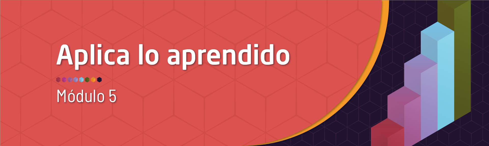

```{r setup, include=FALSE}
knitr::opts_chunk$set(echo = TRUE,comment = NA)

# colores
c0= "#b0394a"
c1= "#ad6395"
c2= "#a391c4"
c3= "#8acfe6"
c4= "#646420"
c5= "#db524f" 


```

<span style="color:#E77C00">**En construcción**</span>




<br/><br/>

# **Guía de aprendizaje 5.2**

<br/><br/>

## **Introducción**

<br/><br/>

## **Objetivos de la unidad**

<br/><br/>

## **Duración**

<br/><br/>

## **Cronograma de trabajo**


<br/><br/>

## **Criterios de evaluación**

<br/><br/>

## **Entregables** 

<br/><br/>
# **Recursos**